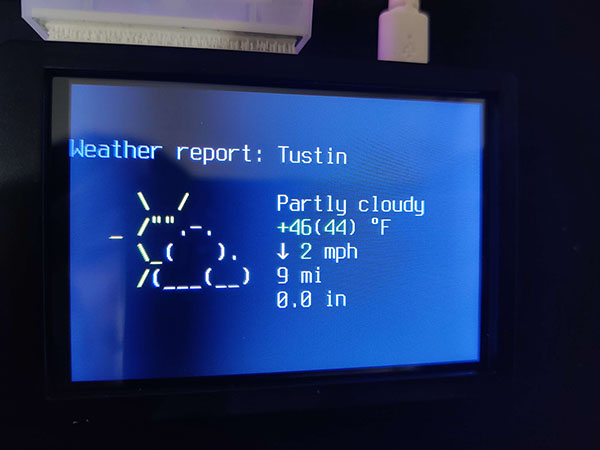
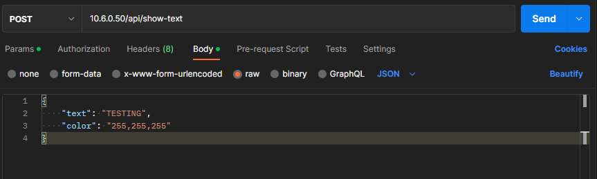
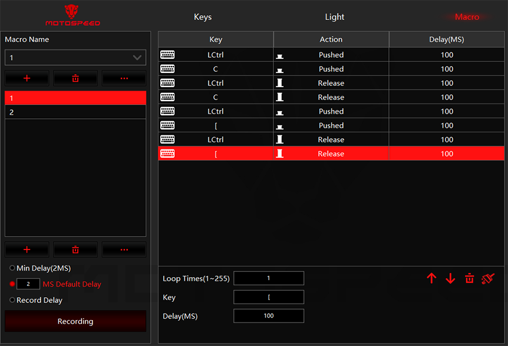
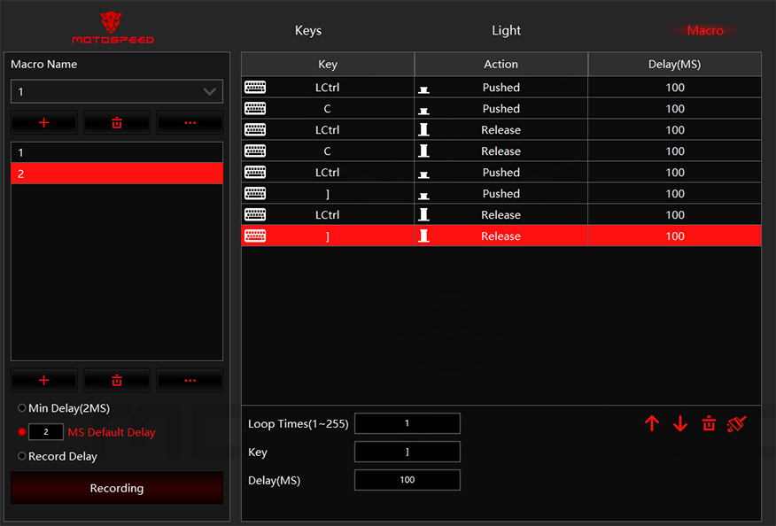
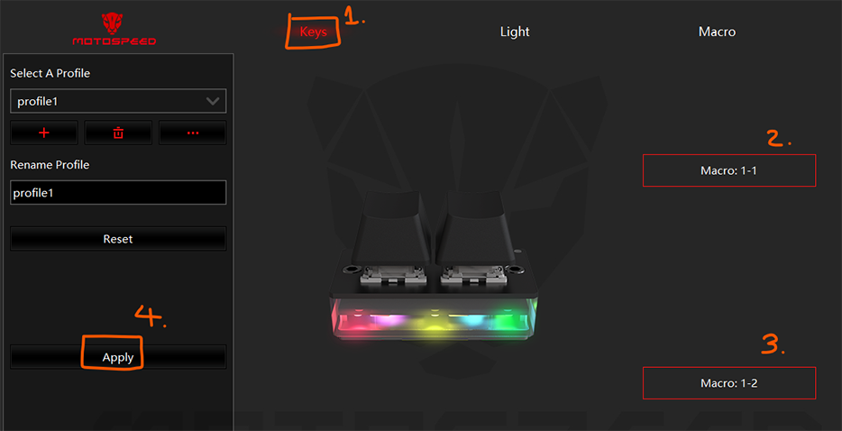

# Pi-Attention

Do you have an issue with missing your DM? Maybe you've tunnel-visioned on something, and totally missed that important message that your SO sent you. Perhaps you've been accused of ignoring your love one messages ~~with no fault of your own~~ ? Maybe you need something *in your face* to remind you?

Well, worry no more, because ~~PAY~~**PI-ATTENTION** will solve this for you!

See the quick demo below!


# Introduction

Pi-Attention is a simple pager transmitter and receiver. Its primary function is to send a predefined message using a single button, which will then be displayed on a LED pi hat. The idea is that you'll be in your room working with the Pi-Attention receiver on your desk. Then your SO or kids can send you a simple message such as "Come Outside!" or "Check Your Phone!" using the PI-Attention receiver. This will display said message in a bright LED which will grab your attention. The transmitter is coded so that only one message can be send at once, so it'll prevent repeated button spamming. 

While idle, the transmitter acts as a weather reporting screen, so you can get TWO awesome tools for the price of one :)




# How it works

## Receiver
The receiver is a Raspberry Pi Zero WH with GPIO Header + wireless function and a Unicorn Mini led hat mounted on it. This will run as a Python Flask server listening to request from the transmitter. It'll take in a JSON body containing a text and RGB color code, which it will then display said text with the color requested onto the LED display in a scrolling text fashion.

## Transmitter
The transmitter is a Raspberry Pi 4 containing a small 3.5" LCD screen and a two key MOTOSPEED K2 keyboard. The transmitter does the following two things:
1. When idle, it acts as a current weather report station
2. When a key is pressed, it sends a KeyboardInterrupt to the weather report display and send a POST message to the receiver with a predefined message and RGB color JSON body
    - To achieve this, the MOTOSPEED K2 keyboard needs to be run as a macro to send a KeyboardInterrupt shortcut first (`CTRL+C`) following another shortcut to start the script
    - In this case, the second shortcuts to run scripts are `CTRL+[` and `CTRL+]` for each keys
    - After the message is transmitted, it'll start the current weather display again, completing the loop

# Hardware

### Transmitter:
    - Raspberry Pi 4 + microSD card for OS
    - GeeekPi Raspberry Pi 4 3.5 Inch Touch Screen with Case - https://www.amazon.com/gp/product/B083C12N57
    - MOTOSPEED K2 2 Programmable Keys Keyboard - https://www.amazon.com/Motospeed-Keyboards-Mechanical-Programmable-Switches/dp/B098PWQT3H
    - 0.5ft USB-A to USB-C Cable (Optional) - https://www.amazon.com/gp/product/B07T8FR5L9/
    - Command Strip (Optional)

### Receiver:
    - Raspberry Pi Zero WH (or you can buy the W version and solder on GPIO Header yourself!) + microSD card for OS
    - Unicorn Hat Mini - https://shop.pimoroni.com/products/unicorn-hat-mini?variant=31657688498259 

### Putting it all together:
    - Hardware:
        - Install the LCD Screen with case according to instruction
        - Mount the MOTOSPEED K2 on top the Pi's charging port side using command strip
        - Use the short 0.5ft USB-C cable to connect the keyboard to Pi
    - Software:
        - Mount the Unicorn Mini Hat to the GPIO of the Pi-Zero


# Raspberry Pi Setup

For both the transmitter and receiver, image the raspberry pi micro sd card using the official Raspberry Pi Imager: https://www.raspberrypi.com/software/

For OS, use the **Raspberry Pi OF Lite (32-bit)** version. Make sure that both are using the **_SAME WIFI NETWORK_**

Once they're image and you're able to ssh in, install the following packages:

```
sudo apt-get update
sudo apt-get install python3 python3-pip git
```

# Receiver Setup

On the Raspberry Pi Zero W, SSH in and perform the following steps:

1. Enable SPI
```
sudo raspi-config nonint do_spi 0
```
2. Install Unicorn Mini Hat library. Select `n` when it gives option to copy examples
```
git clone https://github.com/pimoroni/unicornhatmini-python
cd unicornhatmini-python
sudo ./install.sh
```
3. Clone this repo
```
cd ~/
git clone https://github.com/dqle/pi-attention.git
```
4. Install python packages
```
cd pi-attention/receiver/
sudo pip3 install -r requirements.txt
```
5. Add the program as a service
```
sudo cp pi-attention.service /etc/systemd/system/
sudo systemctl daemon-reload
```
6. Enable and start service -- Verify that the service is starting properly
```
sudo systemctl enable pi-attention
sudo systemctl start pi-attention
sudo systemctl status pi-attention
```

You should get something like:
```
pi@pi-attention-receiver:~/pi-attention/receiver $ systemctl status pi-attention
● pi-attention.service - Pi Attention Flask
     Loaded: loaded (/etc/systemd/system/pi-attention.service; enabled; vendor preset: enabled)
     Active: active (running) since Thu 2023-01-12 09:44:23 PST; 6s ago
   Main PID: 6384 (python3)
      Tasks: 1 (limit: 415)
        CPU: 4.127s
     CGroup: /system.slice/pi-attention.service
             └─6384 python3 /home/pi/pi-attention/receiver/main.py

Jan 12 09:44:23 pi-attention-receiver systemd[1]: Started Pi Attention Flask.
Jan 12 09:44:28 pi-attention-receiver python3[6384]:  * Serving Flask app 'main'
Jan 12 09:44:28 pi-attention-receiver python3[6384]:  * Debug mode: off

```
7. Test the service using Postman from your main computer - Make sure your main computer is also in the same network as the receiver


You should get a `TESTING` scrolling text on your LED display.


# Transmitter Setup

## Setting up the Motospeed K2 Keyboard
1. Plug in the keyboard into your Windows computer
2. Download the driver from here: http://www.motospeed.cc/index.php?ac=article&at=read&did=572
3. Install the driver and open the program
4. Navigate to the macro section and create your two macros according to the below:

Macro 1:



Macro 2:



5. Go back to Keys tab. Assign your buttons to the macro created. Then Apply



What this does is that it'll send a KeyboardInterrupt before running the keyboard combo (CTRL+[ or CTRL+]) which will be used to start the script.

## Setting up the transmitter

On the Raspberry Pi 4, SSH in and perform the following steps:

1. Enable Console Autologin
```
Run: sudo raspi-config
Choose option: 1 System Options
Choose option: S5 Boot / Auto Login
Choose option: B2 Console Autologin
Select Finish, but do not reboot
```
2. Set Font and Font Size
```
sudo sed -i "s|FONTFACE=.*|FONTFACE=\"Terminus\"|g" /etc/default/console-setup
sudo sed -i "s|FONTSIZE=.*|FONTSIZE=\"14x28\"|g" /etc/default/console-setup
```
3. Clone this repo
```
git clone https://github.com/dqle/pi-attention.git
```

4. Set Keybinds and startup settings 
```
cd pi-attention/transmitter/
chmod +x set-keybind.sh
./set-keybind.sh
```

5. Install Python3 packages
```
pip3 install -r requirements.txt
```

6. Install the LCD screen driver
```
cd ~/
git clone https://github.com/goodtft/LCD-show.git
chmod -R 755 LCD-show
cd LCD-show/
sudo ./LCD35-show 180
```

This will automatically reboot your pi. The screen should come up with current weather display and everything ready to go!

# Change Text and Color

You can change text and color of the message sent by updating the `button1.py` and `button2.py` files in the transmitter with any of your favorite text editing tools such as Vim or Nano. 
